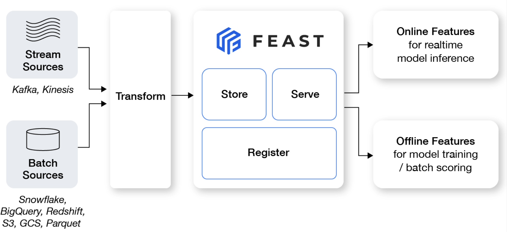

# feast-example
Familiar with feature store (feast)

### What is Feast?
Feast is an operational system for managing and serving machine learning features to models in production. It can serve features from a low-latency online store (for real-time prediction) or from an offline store (for  batch scoring). 

### What is Feast not?
- Feast does not orchestrate data pipelines (e.g. batch / stream transformation or materialization jobs), but provides a framework to integrate with adjacent tools like dbt, Airflow, and Spark.
- Feast also does not solve other commonly faced issues like data quality, experiment management, etc. 

See more details at [What Feast is not](https://docs.feast.dev/#what-feast-is-not).

### Why Feast?
Feast solves several common challenges teams face:
1. Lack of feature reuse across teams
2. Complex point-in-time-correct data joins for generating training data
3. Difficulty operationalizing features for online inference while minimizing training / serving skew

### Pre-requisites
This workshop assumes you have the following installed:
- A local development environment that supports running Jupyter notebooks (e.g. VSCode with Jupyter plugin)
- Python 3.8+
- pip
  - Docker & Docker Compose (e.g. `brew install docker docker-compose`)

### Reference:
1. https://docs.feast.dev/getting-started/quickstart
3. https://github.com/juskuz/feast-driver-ranking-demo-aitech
4. https://github.com/feast-dev/feast-workshop
